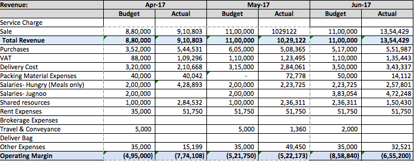

---

layout: post-journal
title: My work at Jugnoo
date:   2017-07-25 09:00:11
tag:
categories: journal
excerpt: 
permalink: /jugnoo

---

Jugnoo is a hyperlocal on-demand services startup, headquartered in Chandigarh, India.  I was hired as a product manager for their main offering: an all-in-one mobile application which allowed consumers to order rides, budget meals, restaurant food and grocery on-demand.[^fatafat] At the time I joined, 3 million consumers in about 38 indian cities used the application for rides;   restaurant delivery was active in about 21 cities; grocery delivery was active in Gurgaon and Chandigarh, and budget meals delivery from our in-house kitchen was running in Gurgaon, Jaipur and Chandigarh.  

[^fatafat]:  The grocery delivery segment was Fatafat. In Chandigarh, Fatafat clocked 150 orders per day. On an average value of an order is Rs 1,500 with Fatafat earning a 30% commission. During my time, we Fatafat transformed from an online grocery store to an aggregator of grocery stores. 

**Making food delivery operationally profitable**

I started looking at our meals delivery vertical only three month into my job - by which time the sphere of my responsibility had increased to the entire Jugnoo app, and my team size had grown from five to fifteen. 

Before I took over the our Meals product, we were following a sort of 'order-in-advance' model. Orders were aggregated beforehand for breakfast, lunch and dinner time slots.  Ordering window was closed 15 mins before the start of a slot time and delivery personel were dispatched. There were many benefits to this model. It allowed us to control delivery costs by clubbing orders together and optimising routes. Since we demand was completely determined before the delivery personnel were dispatched, wastage was less.  Both these factors allowed us to keep our prices.  We appealed to customers who were budget-sensitive and planned their lunches and dinners beforehand. 

Our pricing was certainly low - but so was our unit profit. Jugnoo Meals was floundering: we had achieved unit profitability but were running at a loss operationally. Here is our P&L statement for March 2016:

Below is the unit economics for Chandigarh.[^mealsMarch] 

[^mealsMarch]: We were clocking about 250 orders/day. Average COGS (includes costs of wastage) is 47% of AOV. Average COGS (includes costs of wastage) is 47% of AOV.  Average delivery Cost is 22% of AOV. Average VAT is about 12.5 % of AOV. Cost of Packaging material 4.3% of AOV. Total Variable Costs = Rs. 50 + 23.3 + 13.2 + 4.6. Profit per order = Rs. 106 - 91 = Rs. 15 (14% profit margin). 

>  **Average order value: Rs. 106.**

> **The Cost of Goods Sold: Rs. 50**

>  **Delivery Cost: Rs. 23.3**

>  **Taxes: Rs. 13.2**

> **Packing: Rs. 4.6**

>  **Unit Costs: Rs. 91**

> **Unit Profit: Rs. 15**

We were making Rs. 15 on every order. With fixed costs (including salaries and rent) being about Rs. 8 lakh, this required us to do about 1800 orders/day just to break even.

This had proven to be an impossible task. The meals team had they had hit a ceiling with regards to the demand. While our SLA was very good (above 90%), we had not got more than 250 orders/day for six months, despite lots of experimentation and toil.  The team decided to close down operations in Jaipur and Gurgaon and focus on Chandigarh until we got the model right. 

This is what we realised: most people who order food online do not plan their lunches or dinners beforehand. They expected the food within 30-40 mins of ordering. They care for instant delivery much more than they cared for price.

So when I took over the Meals product,  we pivoted to an lnstant Delivery Model. We guaranteed the delivery within 20 mins by sending additional stock with the riders on a route beforehand. 

However, there were risks:
* We were promising delivery within 20 mins, which is the best in the meals delivery segment among any player. We setting such a high target, we risked having our SLA drop to unsatisfactory levels.
* Since we could not predict demand beforehand, we would have to hazard a guess as to what what the demand might beforehand. So COGS would explode. 
* Since our drivers routes were not optimized based ocosts mightn order aggregation, we were afraid that our delivery costs might shoot up. 

To keep these metrics in check, while increasing demand,  the features my team shipped proved to be crucial. 

##### Meals Traffic Controller 

Time was of the essence in fulfilling SLA. I would sit in the kitchen with my laptop all day and observe the problems failed by the operations team. The team had a tiny window of opportunity when an order came in to assign it to the right driver in the right region with the right stock. Mistakes were costly: if an order was assigned to a driver who did not have a particular food item, or assigned to a driver far off, it would affect our SLA and delivery cost. The situation in the kitchen reminded me of the job traffic controllers face when assigning runaways to incoming airplanes. Thus was born my first product to assist the Meals operations team: the traffic controller. 

Traffic Controller was a webpanel for the kitchen admin. It had a Trello Card-like interace, which would show each driver as a separate card. Within the card was information about the region assigned to the driver, his current  stock, contact information, and so on.  The kitchen admin assign incoming orders based on that. 

The result? We were able to keep SLA above 80% - better than anyone expected.

##### Early Bird Discount

We preferred that customers ordered in advance - it would give us a better idea of the demand and help us reduce wastage and COGS. To incentive early ordering, we shipped an early bird discount feature on the application. The discount would appear on the Meals page as a countdown. Simulatanously, we slighly increased the price of meals, to improve our unit margin. The early bird discount allowed us to engage and retain our old budget-sensitive user based while we added the price-insensitive users. 

The result? Average ticket size increased from Rs. 106 to Rs. 112, COGS as a percentage of order value decreased from 47% to 40.7%.

##### Menu Planner

People who order food online demand consistent quality but also get very quickly bored with the menu. So the operations team changed the menu day-to-day and also experimented with new products. [^newFood] They would plan their menu such that it certain minimum requirements of profitability, diversity, and performance.

To enable this, we provided the team with a web-based menu planner. The menu planner showed previous sales and costs for each food item and raised alerts when the menu didn't include, for example, a non-vegetarian dish, or a bread-based dish, or from a particular cuisine. 

[^newFood]: Among items we tried were like the Maggi Sandwich, Dabeli, Bombay Sandwich, Paneer Khurchan. I remember these experiments fondlY,  because I would usually be one of the tasters! 

##### Bookmarking Favourite Meals

The flip side of a changing menu was that when a food item a consumer had liked appears on the menu again, they wouldn't get to know unless they happened to open the app! 

To re-engage our old customers and make them order again, we introduced a favouriting feature. Customers would book mark their favourite food iterms as "favourite" and get a notification whenever that food item was on the menu agan.

I worked on Meals for four months (March-July. ) Here's the P&L statement from June:

The unit economics: [^mealsJune]: 

[^mealsJune]: We were clocking about 400 orders/day. Average COGS (includes costs of wastage) is 40.7% of AOV.  Average delivery Cost is 25.3% of AOV (from earlier 22). Average tax is about 10 % of AOV. Cost of Packaging material 1% of AOV. Total Variable Costs = Rs. 46 + 28.5 + 11.3 + 1.1 = 86.9 Profit per order = Rs. 112 - 86.9 = Rs. 25.1 (22.4% profit margin). 

>  **Average order value: Rs. 112.8**

> **The Cost of Goods Sold: Rs. 46**

>  **Delivery Cost: Rs. 28.5**

>  **Taxes: Rs. 11.3**

> **Packing: Rs. 1.1**

>  **Unit Costs: Rs. 86.9**

> **Unit Profit: Rs. 25.1**

The profit we were making on each order had increased by 67%: from Rs. 15 to Rs. 25.1, without decreasing SLA, customer satisfaction, or the number of orders/day. On the contrary, by July,  our #orders/day had doubled: from the earlier 250 to 500!

Our fixed costs were about Rs. 8 lakh/month. Earlier, we needed to increase our orders/day by 7.2x to break even. In just three months, not only had we increased the demand by 2x, but our new unit econimcs required that we needed to only reach 4x our original demand (1000 orders/day) to be operationally profitable. 

We were well were  on our way to reach that landmark. In July, GST was implemented nationwide. We used this as an opportunity to increase the price even further.  From the experience of the past three months, we had observed that our customers were less price-sensitive than we had initially expected them to be. By increasing the price, we thought we might be able lower the 4x target without decreasing our current demand. 

Though there were still many interesting questions to explore,[^stock] at this point, with Meals well on its way to profitability, I turned my attention to other verticals. 

[^stock]: What is the right stock to send with a driver? Sending too little would decrease order/driver and increase the delivery costs (and might disturb the SLA), sending too much would increase wastage. 

---

**Jugnoo Star: Shipping a subscription product**

Star was actually the first feature I had shipped. Jugnoo had a “sink or swim”  onboarding strategy. One was expected to hit the ground running. So when I joined, within my first week, I was tasked with launching our subscription feature. I was assigned a team of seven[^team] and the deadline was two weeks

For Indian startups,  CAC to LTV (life time value for a customer) ratios are very high. Most e-commerce/transaction businesses struggle with retention. They need to spend large amounts of capital to re-engage customers and transact again on the platform. In addition, companies have to pay extremely high prices to various marketing channels in addition to discounting for customer acquisition.  Some companies even spend as high as Rs 1200 to acquire a customer.  The idea behind Jugnoo Star Subscription was to increase LTV. 

In two weeks, I familiarized myself with every part of the product, made user journeys, wireframes, mockups and detailed user-stories for the developers to follow.   We decided to offer free delivery on groceries, and cashbacks on meals (8%) and restaurant delivery (2%).  The initial pricing  was (Rs. 99 for monthly subscription and Rs. 499 for annual) as a day-one hypothesis.

Initially, only a few signed up. 

It caused a major point of contention between me and Samar, the CEO. Samar had wanted me  to forcefeed Star as a dogfood to company employees - to get the initial data needed to iterate. However, I wanted to wait for userbase to grow organically. It would have I felt having data from users who were forced into it -  who did not really need the subscription feature - would make the data artifical and unreliable. In addition, forcing someone to pay for something they did not need conflicted with my liberal instincts. 

Eventually, we got more than 50 users who signed up organically. That doesn't sound much - but having been launched softly - without any marketing only in Chandigarh, that data was enough for us to revise our pricing and improve the conversion funnel. I talked to almost all of those customers directly on phone for feedback. 

Later, we revised the pricing and shipped features to impoving retention. I made a customer lifetime journey and defined touchpoints for email and reminder pushes when the subscription was near expiry or had expired. 

By the time I left Jugnoo, Star had 29 active monthly subscribers and 35 annual subscribers. I am not 100% about numbers, but our data was this: at a price of Rs. 135/mo, the monthly retention was 7%, increase in profits/customerdue to increased frequency of transactions was Rs. 163, and the costs of benefits were Rs. 84.  

**New Verticals: AskLocal and Jugnoo Pros**

Re-engaging customers on ecommerce platforms is a tough ask.  Unless customers visit the platform for something else (e.g. content, reviews, photos, and sharing) and then naturally move into the transaction flow, it is very hard to drive high re-engagement rates for commerce platforms.

This is where AskLocal came in. AskLocal was city-wise QnA platform where users asked and answered each others question. Taking design inspiration from YikYak (an anonymous messaging app now shut down), I led a small unit of five within my team to deliver the first version in two weeks. 

Since the product still needed to be polished, we decided to do a waitlisted launch and only gradually open it to users. W  Our hope was that this would create a 'buzz' and eventually drive a lot of traffic, but it didn't pan out that way. e did a city-by-city launch and did some minor PR. 

At the time I left, we had worked on AskLocal for two  months and had grown it to 3000+ users posting 10 posts/ day. 

----

**The Power of a Simple Design Change**

Checkout Slider

**Feature That Did Not Have Much Impact**
Enrollment increased from 10,000 fromt he time I joined to 22000 by the time I left. 

Driver app: Driver App: Self Enrollment, Resources (Training Module, Ticketing
Menus One-click Filter & 
Dispatch new drivers. 

**Mistakes and Learnings**

Referrals story
- Competitor Analysis for best practices
- Right Entry Points (Referral at checkout, during a ride etc.)
- Login/Signup Mistake
- Send Free Gift Experiment

Referrals down from from 18% to 10%

Login/Signup via Account Kit
- Reduced SMS cost
- Improved funnel  (40%)

**Summary**

I worked at Jugnoo for a little over eight months. I went from redesigning buttons to launching new business verticals; my team grew from five to fifteen, including Android, iOS, Backend and QA engineers; I mentored new product managers, and I also had my first experience of firing someone. 

***

*If you are interested in the economics of food delivery, or on-demand services industry in general, please don't hesitate to reach out to me.* 

***

<!-- 

ATTENTION TO DETAIL

“Tell me about a time you made errors in your work.”

They are looking for learnings, what steps you are now following to ensure a high level of accuracy in your work. They also want to see you have taken responsibility for your actions.
- Brief the background of the situation, alongside the error you made.
- Take responsibility for the error.
- Discuss how you fixed the problem, highlighting the speed you made the corrections.
- Talk about what you learnt, and the process you now follow to ensure it doesn’t reoccur.
“What was your bosses reaction when the errors were found?”
“Tell me more about the obstacles this created for you in your work (after the mistakes).”

DECISION MAKING 

“Tell me about a time where you took a course of action your team did not agree with.”
“How did you handle the process, and what was the reaction from your team?”
“How did you react to the negativity from the team?”
“What did you learn from this situation?”
“What would you change if you could redo this task from scratch?”

* Made the team @ Jugnoo work overtime. 
* 

[^analysis]:  *“Describe the most sophisticated analysis you have conducted in your work to reach a decision”*
*“How did you know how to proceed?”*
*“What brought you to the recommendation that you made?”*
*“Was your manager pleased with your recommendation?”* 
They are looking for the processes you follow to reach a decision, to determine if you have a logical approach. They also want to see the level of technical skill you have in analysis. Tips:
- Use a project at university or an example that required you to do statistical modelling.
- Explain what made it sophisticated (was it the data source, the method of analysis, etc).
- Discuss the process involved in reaching a decision, the rationale you followed.

[^project]: *Tell me of an instance when you quickly gathered information from various sources.*  Lead complex and time-critical projects for senior leaders by quickly understanding context and developing a prioritized approach for resolution. (following structured processes & getting results). Can create sophisticated models/analysis

[^initiative]:  *“Tell me about a time you raised your hand to tackle a new assignment which you had no experience with.” “What steps did you take to approach the task?” “What were you thinking at this point?”* They are looking at your information gathering process, and ability to make effective decisions with limited data. Also judging your willingness to learn, and go above and beyond in your work. Explain why you wanted the project. Highlight the chance to learn, willingness to do more. Discuss how you got the information you needed for the task. Go into detail about how your skill in (communication/programming etc.) made it possible for this task to be a success. Confirm that you would put your hand up again. 

[^change]: *“Tell me about a time where you had to explain a new concept to a colleague.” What did you do differently that was successful in bringing them on board?”“What did your colleague say throughout the process?” “How did they react to your explanation?”*
They are looking for examples of your verbal communication ability, and skills in influencing. They want to grasp your understanding of the change process, as well as confirm you know that different people need to learn new concepts differently.
- Talk about the process you took in preparing for the conversation.
- Discuss the pivotal point in getting understanding and acceptance from your colleague.
- Reflect on why you were successful in explaining this to your colleague.
“

 -->

