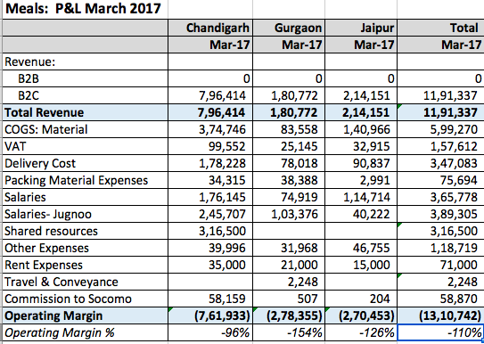

---

layout: post-journal
title: My work at Jugnoo
date:   2017-07-25 09:00:11
tag:
categories: journal
excerpt: 
permalink: /jugnoo

---

Jugnoo is a hyperlocal on-demand services startup, headquartered in Chandigarh, India.  I was hired as a second product manager for their main offering: an all-in-one mobile application which allowed consumers to order rides, budget meals, restaurant food and grocery on-demand. At the time I joined,  the rides vertical alone was used by 3 million consumers in about 38 indian cities;   restaurant delivery in about 21 cities; meals had just launched in Gurgaon and Jaipur in addition to Chandigarh; and grocery delivery was just taking off in Gurgaon and Chandigarh.  clocks 42,000 bookings per day

**Making food delivery operationally profitable**

The work I am most proud of at Jugnoo was in their meals vertical. I started looking at it only three month into my job - by which time I had grown into my role to take care of the entire Jugnoo app, and my team size had grown from five to fifteen. 

Jugnoo Meals was floundering: although we had achieved unit profitability but were running at a loss operationally. Here, for example, is our P&L statement for March 2016:

Let's look at the unit economics for Chandigarh. We were clocking ~250 orders/day. Average COGS (includes costs of wastage) is 47% of AOV. Average COGS (includes costs of wastage) is 47% of AOV.  Average delivery Cost is 22% of AOV. Average VAT is about 12.5 % of AOV. Cost of Packaging material 4.3% of AOV. Total Variable Costs = Rs. 50 + 23.3 + 13.2 + 4.6.
Profit per order = Rs. 106 - 91 = Rs. 15 (14% profit margin). 

Summing up:

>  **Average order value: Rs. 106.**

> **The Cost of Goods Sold: Rs. 50**

>  **Delivery Cost: Rs. 23.3**

>  **Taxes: Rs. 13.2**

> **Packing: Rs. 4.6**

>  **Unit Costs: Rs. 91**

> **Unit Profit: Rs. 15**

We were making Rs. 15 on every order. With fixed costs (including salaries and rent) being about Rs. 8 lakh, the unit economics demanded that we would need to do about 1800 orders/day to break even.

This had proven to be an impossible task. From the time I had joined, the meals team had  they had hit a ceiling with regards to the demand. While our SLA was very good (above 90%) orders/day in Chandigarh would not break above 250. 

The team decided to close down the kitchen in Jaipur and shutter our expansion plans until we got the model right. 

What was our model?

Orders were aggregated beforehand for breakfast, lunch and dinner time slots.  Ordering window was closed 15 mins before the start of a slot time and delivery personel were dispatched. There were many benefits to this model:

* It allowed us to deliver meals cheap.
    - Allowed us to control delivery costs by clubbing orders together and optimising routes.
    - Wastage was less since we knew beforehand how much demand to fulfil. 
        
However, since our meals might have been cheap, but so was our unit profit.  Our specific demography were the customers who were budget sensitive and planned their lunches and dinners beforehand. 

Most people who order food online do not plan their lunches or dinners beforehand. They expected the food within 30-40 mins of ordering. They care for instant delivery much more than they cared for price.

When I took over the Meals product,  we decided pivoted to an lnstant Delivery Model. We guaranteed the delivery within 20 mins by sending additional stock with the riders on a route beforehand. This was like a hub-and-spoke model. 

However, there were risks:
* We were promising delivery within 20 mins, which is the best in the meals delivery segment among any player. We setting such a high target, we risked having our SLA drop to unsatisfactory levels.
* Since we could not predict demand beforehand, we would have to hazard a guess as to what what the demand might beforehand. So COGS would explode. 
* Since our drivers routes were not optimized based ocosts mightn order aggregation, we were afraid that our delivery costs might shoot up. 

To keep these metrics in check, and increase #orders per day,  the features my team shipped proved to be crucial. 

##### Meals Traffic Controller 

I would sit in the kitchen with my laptop all day and observe the problems failed by the operations team. Time was of the essence in fulfilling SLA. The team had a tiny window of opportunity when an order came in to assign it to the right driver in the right region with the right stock. Mistakes were costly: if an order was assigned to a driver who did not have a particular food item, or assigned to a driver far off, it would affect our SLA and delivery cost. The situation in the kitchen reminded me of the job traffic controllers face when assigning runaways to incoming airplanes. Thus was born my first product to assist team: the Meals traffic controller. 

Traffic Controller was a webpanel for the kitchen admin. It had a Trello Card-like interace, which would show each driver as a separate card. Within the card was information about the region assigned to the driver, his current  stock, contact information, and so on.  The kitchen admin assign incoming orders based on that. 

The result? We did better in SLA than anyone expected. While it dipped a little from the earlier, we were able to keep it above 80%. 

##### Early Bird Discount

We preferred that customers ordered in advance - it would give us a better idea of the demand and help us reduce wastage and COGS. To incentive early ordering, we started giving *early bird discount* feature on meals to customers who ordered early. The discount would appear on the Meals page as a countdown to the time before we dispatched our delivery personell. 

Simulatanously, we increased the price of meals, to improve our unit margin. 

The early bird discount allowed us to engage and retain our old budget-sensitive user based while we added the price-insensitive users. 

The result? Average ticket size increased from Rs. 106 to Rs. 135, while our COGS only increased from Rs. 50 to Rs. 54. 

##### Menu Planner and Bookmarking Favourite Meals

People who order food online demand consistent quality but also get very quickly bored with the menu. So the operations team changed the menu day-to-day and also experimented with new products. [^newFood] The flip side of this was that when a food item a consumer had liked appears on the menu again, they wouldn't get to know unless they happened to open the app! 

So we introduced a favourite feature where customers would get a notification of their meal being on a menu. 

For the operations team, who wanted to plan their menu such that it certain minimum requirements of profitability, diversity, and performance, we we provided a web-based menu planner. The menu planner showed previous sales and costs for each food item and raised alerts when the menu didn't include, for example, a non-vegetarian dish, or a bread-based dish, or from a particular cuisine. 

[^newFood]: Among items we tried were like the Maggi Sandwich, Dabeli, Bombay Sandwich, Paneer Khurchan. I remember these experiments fondlY,  because I would usually be one of the tasters! 

Summing up:

>  **Average order value: Rs. 135.**

> **The Cost of Goods Sold: Rs. 54**

>  **Delivery Cost: Rs. 34.33**

>  **Taxes: Rs. 13.5**

> **Packing: Rs. 1.4**

>  **Unit Costs: Rs. 91**

> **Unit Profit: Rs. 31.77**
#####

Some of the questions which we wanted to answer, but 

What is the right stock to send with a driver? Sending too little would decrease order/driver and increase the delivery costs (and might disturb the SLA), sending too much would increase wastage. 

---

**Jugnoo Star: The metrics and pricing subscription product**

Jugnoo had a “sink or swim”  onboarding strategy. One was expected  to hit the ground running. Within my first week,  I was assigned a team of seven[^team] and tasked with launching our subscription feature. The deadline was two weeks.

[^team]: Two frontend engineers - one each for iOS and Android, four backend engineers, a designer and a QA engineer). Three/Seven were actually a shared resource. 

* 

* The customer engagement and retention for the overall application was low.  India’s CAC to LTV (life time value for a customer) ratios are very bad. Some companies are even acquiring a transacting user for as high as Rs 1200. Why’s that so high? We pay extremely high prices to various marketing channels in addition to discounting for customer acquisition. Also, most e-commerce/transaction businesses have a traffic problem. They need to spend large amounts of capital to re-engage customers i.e. getting them to transact again on the platform.Unless customers visit the platform for something else (e.g. content, reviews, photos, and sharing) and then naturally move into the transaction flow, it is very hard to drive high re-engagement rates for commerce platforms. 
    *  Retention 10-20% after the first week, but would dwindle to 2% by weeks 3-4
* We wanted to explore further use-cases to improve retention and as well as bring growth:  become a one-stop shop for all customers on-demand needs

* Piloted Jugnoo Star Subscription in Chandigarh
    * The idea: the loss in profit on a per unit basis (due to delivery cost in grocery and cash backs in food delivery) would be made up by the increase in frequency of transactions and more retention + subscription fees.  At scale, the delivery cost would decrease. 
    * Launched with benefits and pricing from hunch, iterated based on data and revised pricing.
    * More than 50 Customer Feedback calls.
    * Improved Funnel (From option to choose between annual/monthly at the beginning to option later)
    * Customer lifetime User journey: Defined touchpoints for email, reminder puishes.

* Grew Jugnoo Star experiment to 65 subscribers in Chandigarh
    * 29 Monthly , 36 Annual. 6.96% Retention monhtly
    * Change in orders/month:  6.35 in monthly, 7.28 in annual
    * ARPU/month: Rs. 163 for monthly subscription, Rs. 81 for annual
    * Cost of Star benefits/Month: Rs. 84/mo for monthly users, Rs. 166/mo for annual users
    * Rs. 135/mo for monthly.  Rs.48/month for annual
    * ROI/month: Rs. 236 in monthly users, -Rs. 36 in annual uses

**Fatafat**

About 2 lakh users were registered with Fatafat at the time and the company was receiving more than 1,000 orders a day across four cities. 

In Chandigarh, Fatafat clocks 150 per day. On an average value of an order is R1,500 with Fatafat earning a 30% commission.

**New Verticals: AskLocal and Jugnoo Pros**

* Launched new verticals: Jugnoo Pros (on demand services) and AskLocal (on-demand answers)
* Other Features: Login Signup via FB Account Kit, Payment via UPI, Referral,  Menus One-click Filter & Checkout Slider
* Driver app: Driver App: Self Enrollment, Resources (Training Module, Ticketing

* AskLocal to 3000+ users posting 10 posts/ day and DAU/MAY of 5.68%. Jugnoo Pros enrolled a plumber
* The scope of my responsibilities increased 3x: from a team of 5 to a team of 15 including Android, iOS and backend engineers, QA engineers, designers and junior product managers. 

Challenges.

**Driver Application**
Enrollment increased from 10,000 fromt he time I joined to 22000 by the time I left. 

Dispatch new drivers. 

**Referrals**

- Competitor Analysis for best practices
- Right Entry Points (Referral at checkout, during a ride etc.)
- Login/Signup Mistake
- Send Free Gift Experiment

Referrals down from from 18% to 10%

Login/Signup via Account Kit
- Reduced SMS cost
- Improved funnel  (40%)

***

*If you are interested in the economics of food delivery, or on-demand services industry in general, please don't hesitate to reach out to me.* 

***

<!-- 

ATTENTION TO DETAIL

“Tell me about a time you made errors in your work.”

They are looking for learnings, what steps you are now following to ensure a high level of accuracy in your work. They also want to see you have taken responsibility for your actions.
- Brief the background of the situation, alongside the error you made.
- Take responsibility for the error.
- Discuss how you fixed the problem, highlighting the speed you made the corrections.
- Talk about what you learnt, and the process you now follow to ensure it doesn’t reoccur.
“What was your bosses reaction when the errors were found?”
“Tell me more about the obstacles this created for you in your work (after the mistakes).”

DECISION MAKING 

“Tell me about a time where you took a course of action your team did not agree with.”
“How did you handle the process, and what was the reaction from your team?”
“How did you react to the negativity from the team?”
“What did you learn from this situation?”
“What would you change if you could redo this task from scratch?”

* Made the team @ Jugnoo work overtime. 
* 

[^analysis]:  *“Describe the most sophisticated analysis you have conducted in your work to reach a decision”*
*“How did you know how to proceed?”*
*“What brought you to the recommendation that you made?”*
*“Was your manager pleased with your recommendation?”* 
They are looking for the processes you follow to reach a decision, to determine if you have a logical approach. They also want to see the level of technical skill you have in analysis. Tips:
- Use a project at university or an example that required you to do statistical modelling.
- Explain what made it sophisticated (was it the data source, the method of analysis, etc).
- Discuss the process involved in reaching a decision, the rationale you followed.

[^project]: *Tell me of an instance when you quickly gathered information from various sources.*  Lead complex and time-critical projects for senior leaders by quickly understanding context and developing a prioritized approach for resolution. (following structured processes & getting results). Can create sophisticated models/analysis

[^initiative]:  *“Tell me about a time you raised your hand to tackle a new assignment which you had no experience with.” “What steps did you take to approach the task?” “What were you thinking at this point?”* They are looking at your information gathering process, and ability to make effective decisions with limited data. Also judging your willingness to learn, and go above and beyond in your work. Explain why you wanted the project. Highlight the chance to learn, willingness to do more. Discuss how you got the information you needed for the task. Go into detail about how your skill in (communication/programming etc.) made it possible for this task to be a success. Confirm that you would put your hand up again. 

[^change]: *“Tell me about a time where you had to explain a new concept to a colleague.” What did you do differently that was successful in bringing them on board?”“What did your colleague say throughout the process?” “How did they react to your explanation?”*
They are looking for examples of your verbal communication ability, and skills in influencing. They want to grasp your understanding of the change process, as well as confirm you know that different people need to learn new concepts differently.
- Talk about the process you took in preparing for the conversation.
- Discuss the pivotal point in getting understanding and acceptance from your colleague.
- Reflect on why you were successful in explaining this to your colleague.
“

 -->

