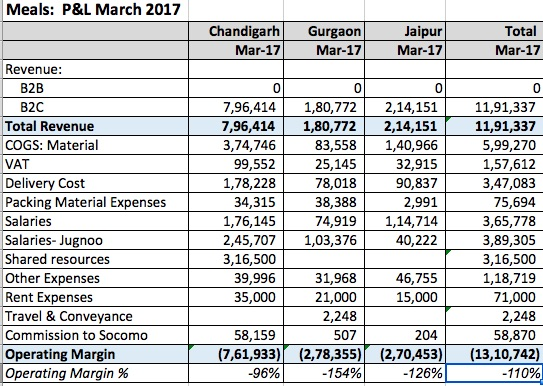
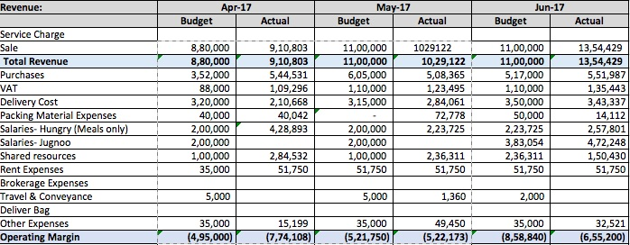

---

layout: post-work-journal
title: Jugnoo
date:   2017-07-25 09:00:11
tag: 
categories: work
excerpt: On-demand services startup<!--  Shipped products for  -->
permalink: /jugnoo
startYear: 2016
endYear: 2017
designation: Product Manager
---

Jugnoo is a hyperlocal on-demand services startup, headquartered in Chandigarh, India.  I was hired as a product manager for their main offering: an all-in-one mobile application which allowed consumers to order rides, budget meals, restaurant food and grocery on-demand.[^fatafat] At the time I joined, 3 million consumers in about 38 indian cities used the application for rides;   restaurant delivery was active in about 21 cities; grocery delivery was active in Gurgaon and Chandigarh, and budget meals delivery from our in-house kitchen was running in Gurgaon, Jaipur and Chandigarh.  

[^fatafat]:  The grocery delivery segment was Fatafat. In Chandigarh, Fatafat clocked 150 orders per day. On an average value of an order is Rs 1,500 with Fatafat earning a 30% commission. During my time, we Fatafat transformed from an online grocery store to an aggregator of grocery stores. 

**Making meal delivery operationally profitable**

I started looking at our meals delivery vertical three month into my job. By this time the sphere of my responsibility covered the entire Jugnoo consumer app, and my team size had grown from five to fifteen. 

For meals delivery, we used to follow an 'order-in-advance' model. Orders were aggregated beforehand for breakfast, lunch and dinner time slots.  Ordering window was closed 15 mins before the start of a slot time and delivery personel were dispatched. 

There were many benefits to this model. It allowed us to control delivery costs by clubbing orders together and optimising routes.  Since the demand was completely determined before the delivery personnel were dispatched, wastage was less.  Low wastage and delivery costs allowed us to pass these savings to consumers and keep our prices low.  Consumers who were budget-sensitive and planned their lunches and dinners beforehand found us appealing. 

Keeping pricing low meant our unit profit was extremely low as well. Indeed, Jugnoo Meals was floundering: we had achieved unit profitability but were running at a loss operationally. Here is our P&L statement for March 2016:

The unit economics[^mealsMarch] for Chandigarh:

[^mealsMarch]: We were clocking about 250 orders/day. Average COGS (includes costs of wastage) is 47% of AOV. Average COGS (includes costs of wastage) is 47% of AOV.  Average delivery Cost is 22% of AOV. Average VAT is about 12.5 % of AOV. Cost of Packaging material 4.3% of AOV. Total Variable Costs = Rs. 50 + 23.3 + 13.2 + 4.6. Profit per order = Rs. 106 - 91 = Rs. 15 (14% profit margin). 
<!-- 

>  **Average order value: Rs. 106.**

> **The Cost of Goods Sold: Rs. 50**

>  **Delivery Cost: Rs. 23.3**

>  **Taxes: Rs. 13.2**

> **Packing: Rs. 4.6**

>  **Unit Costs: Rs. 91**

> **Unit Profit: Rs. 15**
 -->

| Metric                 	|   	|Value (Rs.)|
|:------------------------- |------	|----------:|
| Average order value    	|   	|  106  	|
| The Cost of Goods Sold 	|   	|  50   	|
| Delivery Cost          	|   	|  23.3 	|
| Taxes                  	|   	|  13.2 	|
| Packing                	|   	| 4.6  		|
| Total Unit Costs          |   	| 91   		|
| **Unit Profit**           |   	|  **15**   |
|							|		|			|
| **Orders/Day**            |   	|  **250**  |

We were making Rs. 15 on every order. With fixed costs (including salaries and rent) being about Rs. 8 lakh, this required us to do about 1800 orders/day just to break even.

This had proven to be an impossible task. Despite lots of experimentation and toil, the Meals team had hit a ceiling with regards to the demand. While our SLA was very good (above 90%), we were stuck at less than 250 orders/day for six months.  The team decided to close down operations in Jaipur and Gurgaon and focus on Chandigarh until we got the model right. 

This is what we realised: most people who order food online do not plan their lunches or dinners beforehand. They expected the food within 30-40 mins of ordering. They care for instant delivery much more than they care for price.

So when I took over the Meals product,  we pivoted to an lnstant Delivery Model. We guaranteed the delivery within 20 mins by sending additional stock with the riders on a route beforehand. 

However, there were risks:
* We were promising delivery within 20 mins, which is the best in the meals delivery segment among any player. We setting such a high target, we risked having our SLA drop to unsatisfactory levels.
* Since we could not predict demand beforehand, we would have to hazard a guess as to what what the demand might beforehand. So COGS would explode. 
* Since our drivers routes were not optimized based ocosts mightn order aggregation, we were afraid that our delivery costs might shoot up. 

To make the model successful, the features my product team shipped were crucial. 

##### Meals Traffic Controller 

I would sit in the kitchen with my laptop all day and observe the problems failed by the operations team. Time was of the essence in fulfilling SLA. The team had a tiny window of opportunity when an order came in to assign it to the right driver in the right region with the right stock. Mistakes were costly: if an order was assigned to a driver who did not have a particular food item, or assigned to a driver far off, it would affect our SLA and delivery cost. The situation in the kitchen reminded me of the job traffic controllers face when assigning runaways to incoming airplanes. Thus was born my first product to assist the Meals operations team: the traffic controller. 

Traffic Controller was a webpanel for the kitchen admin. It had a Trello Card-like interace, which would show each driver as a separate card. Within the card was information about the region assigned to the driver, his current  stock, contact details, and other driver specific information.  The kitchen admin assign incoming orders based on that. 

The result? We were able to keep SLA above 80% - which was better than anyone had expected with the new model.

##### Early Bird Discount

We preferred that customers ordered in advance - it would give us a better idea of the demand and help us reduce wastage and COGS. To incentive early ordering, we shipped an early bird discount feature on the application. The discount would appear on the Meals page as a countdown. Simultaneously, we slighly increased the price of meals, to improve our unit margin. The early bird discount allowed us to engage and retain our old budget-sensitive user based while we added the price-insensitive users. 

The result? As the average ticket size increased from Rs. 106 to Rs. 112, COGS as a percentage of order value decreased from 47% to 40.7%.

##### Menu Planner

People who order food online demand consistent quality but also  very quickly get bored if the items are repetetive. So the operations team changed the menu day-to-day and also experimented with new products. [^newFood] They would plan their menu such that it certain threshhold constraints of profitability, diversity, and performance.

To enable this, we provided the team with a web-based menu planner. The menu planner showed previous sales and costs for each food item and raised alerts when the menu didn't include, for example, a non-vegetarian dish, or a bread-based dish, or from an item from Chinese cuisine (say). 

[^newFood]: Among items we tried were like the Maggi Sandwich, Dabeli, Bombay Sandwich, Paneer Khurchan. I remember these experiments fondly,  because I would usually be one of the tasters! 

##### Bookmarking Favourite Meals

The flip side of a changing menu was that when a food item a consumer had liked appears on the menu again, they wouldn't get to know unless they happened to open the app.

To re-engage our old customers and make them order again, we introduced a "favouriting" feature. Customers would bookmark their favourite food items by tapping a heart icon on the thumbnail and get a notification whenever that food item was on the menu agan.

I worked on Meals for four months (March-July. ) Here's the P&L statement from June:

The unit economics are given beow.[^mealsJune]

[^mealsJune]: We were clocking about 400 orders/day. Average COGS (includes costs of wastage) is 40.7% of AOV.  Average delivery Cost is 25.3% of AOV (from earlier 22). Average tax is about 10 % of AOV. Cost of Packaging material 1% of AOV. Total Variable Costs = Rs. 46 + 28.5 + 11.3 + 1.1 = 86.9 Profit per order = Rs. 112 - 86.9 = Rs. 25.1 (22.4% profit margin). 

<!-- >  **Average order value: Rs. 112.8**

> **The Cost of Goods Sold: Rs. 46**

>  **Delivery Cost: Rs. 28.5**

>  **Taxes: Rs. 11.3**

> **Packing: Rs. 1.1**

>  **Unit Costs: Rs. 86.9**

> **Unit Profit: Rs. ** -->

| Metric                 	|   	|Value (Rs.)|
|:------------------------- |------	|----------:|
| Average order value    	|   	|  106  	|
| The Cost of Goods Sold 	|   	|  46   	|
| Delivery Cost          	|   	|  28.5 	|
| Taxes                  	|   	|  11.3 	|
| Packing                	|   	| 1.1  		|
| Total Unit Costs          |   	| 86.9   	|
| **Unit Profit**           |   	|  **25.1** |
|							|		|			|
| **Orders/Day**            |   	|  **400**  |

The profit we were making on each order had increased by 67%: from Rs. 15 to Rs. 25.1, without decreasing SLA, customer satisfaction, or the number of orders/day. On the contrary, by July, our orders/day had doubled from 250 to 500!

Our fixed costs were about Rs. 8 lakh/month. In our earlier model, we had needed to increase our orders/day by 7.2x to break even. In just three months, not only had we scaled our demand by 2x, but our improved unit profitability required meant that 4x our original demand (1000 orders/day) was sufficient for us to be operationally profitable. 

We were well were  on our way to reach that landmark. In July, GST was implemented nationwide. We used this as an opportunity to increase the price even further.  From the experience of the past three months, we had observed that our customers were less price-sensitive than we had initially expected them to be. By increasing the price, we thought we might be able lower the 4x target without decreasing our current demand. 

---

**Jugnoo Star: Increasing LTV through a subscription product**

Jugnoo had a “sink or swim”  onboarding strategy. Every new hire was expected to hit the ground running. So when I joined, within my first week, I was tasked with launching our subscription feature. I was assigned a team of seven and a deadline of two weeks. Jugnoo Star became the first feature I shipped.[^star] 

[^star]: For Indian startups,  CAC to LTV (life time value for a customer) ratios are very high. Most e-commerce/transaction businesses struggle with retention. They need to spend large amounts of capital to re-engage customers and transact again on the platform. In addition, companies have to pay extremely high prices to various marketing channels in addition to discounting for customer acquisition.  Some companies even spend as high as Rs 1200 to acquire a customer.  The idea behind Jugnoo Star was to increase LTV. 

In those two weeks, I familiarized myself with every part of the product. I  made user journeys, wireframes, mockups and detailed user-stories for the team. We had the business-side approval for offering free delivery on groceries,8% cashbacks on meals  and 2% cashbacks on restaurant delivery.  The initial pricing  was (Rs. 99 for monthly subscription and Rs. 499 for annual)  a day-one hypothesis. We did a soft launch, with no marketing and no PR. 

Initially, only a few signed up.

The lack of early users caused a major point of contention between me and Samar, the CEO. Samar had wanted me to forcefeed Star as a dogfood to company employees - to get the initial data needed to iterate. However, I wanted to wait for userbase to grow organically. It would have I felt having data from users who were forced into it -  who did not really need the subscription feature - would make the data artifical and unreliable. In addition, forcing someone to pay for something they did not need conflicted with my liberal instincts. 

Eventually, I caved in and asked the entire Jugnoo product team to sign up. Most did. And left the program within a month - without any transactions. 

Over the course of the year, more than 60 users signed up organically. I talked to almost all of those customers directly on phone for feedback. 

Later, we revised the pricing, improved the conversion funnel,  and shipped features to impoving retention. I made a customer lifetime journey and defined touchpoints for email. We automated reminder pushes sent when the subscription was near expiry or had expired. 

By the time I left Jugnoo, Star had 29 active monthly subscribers and 35 annual subscribers. The data looked something like this: at a price of Rs. 135/mo, the monthly retention was 7%, increase in profits/customer was Rs. 163, and the costs of benefits were Rs. 84.  

**AskLocal: A hyperloal Quora to engage customers with content**

Re-engaging customers on ecommerce platforms is a tough ask.  Unless customers visit the platform for something else (e.g. content, reviews, photos, and sharing) and then naturally move into the transaction flow, it is very hard to drive high re-engagement rates for these platforms.

This is where AskLocal came in. AskLocal was city-wise QnA platform where users asked and answered each others question. I led a small unit of five within my team to deliver the first version in two weeks. 

Since the product still needed to be polished, we decided to do a waitlisted launch and only gradually open it to users.  We did a city-by-city launch and did some minor PR.  Our hope was that this would create a 'buzz' and eventually drive a lot of traffic, but it didn't pan out that way.

At the time I left Jugnoo, we had worked on AskLocal for two months and had grown it to 3000+ users posting 10 posts/ day. 

----

**Increasing Checkout conversion through good UX**

Our checkout page (used for meals, restaurant or grocery delivery) was long: one had to scroll to the end to verify that all inputs were correct: the shopping cart, the payment mode, coupons redeemed etc. But our most frequent users usually had everything prefilled and just wanted to order as quickly as possible. It seemed inefficient to me that our power users had to scroll all the way down to the bottom to get to the "Pay" button. My hypothesis was that if the button float on top of the checkout page, it would increase our conversiion rate at checkout page.

This failed basic usability testing. This is what would happen :Users - especially new users - were trigger happy. When they saw a call to action, they would click on it, regardless of whether they had correct checkout information prefilled or not. So we were back to the old design with its  compulsory scrolling.

Could we find a way to allow our power users a quicker checkout experience AND prevent trigger-happy users to press the Pay button by mistake? The answer, it turned out, was YES.

We changed the Pay button to a Pay 'slider': instead of merely pressing, one had to drag a slider across in order to finish the transaction. This would float at the bottom and was ever present. 

The design was a resounding success.   It seemed that the effort to pull the slider to the right forced the users - even those who unthinkingly press the red button -  into a more considered and deliberative mode of interaction with the app. Even better - the users found the slider experience pleasant.

----

**Enrollment, Onboaring and Training of New Drivers**

I also shipped two major features on the Driver app: (1) a revamp of the onboarding and enrollment process for new drivers to make it much easier for drivers to self-enroll, and (2) an in-app tutorial for drivers which simulated an actual ride: from first request to fare collection. The idea was to decrease the time it took between a new driver's registeration and his first ride.

However, these features were not used as much as one would have liked.  Our driver registrations increased from 10,000 when I started to 22000 by the time I left, but I suspect that was due to a sustained enrollment push during that period.

**Summary**

I worked at Jugnoo for a little over eight months. I went from something as simple as redesigning buttons to launching new product verticals; my team grew from five to fifteen, including Mobile, Backend and QA engineers; I mentored new product managers, and I got my first taste of startup life.

***

