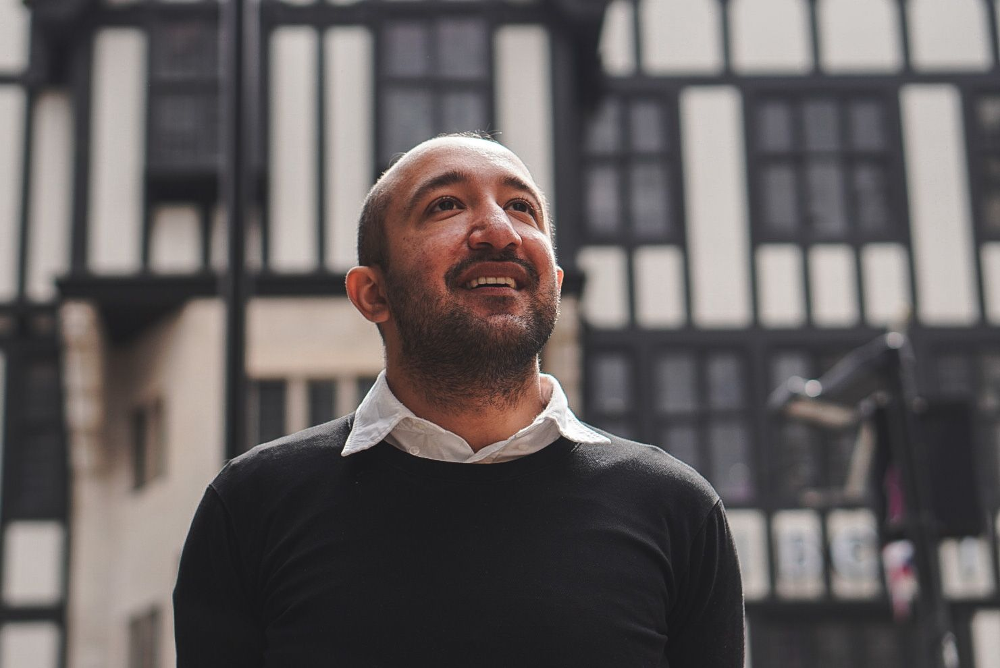

**Currently**

   

I am on a career break.

<!-- I would like to bring philosophy to bear on daily life through products people use and events they attend.  -->

These are the projects I am spending this time on

* Meeting Without Masks
* Platonia: a social network based on skills 
* Salt To Taste: a series of essays on authenticity
  

<!-- * [A Writing Course](https://piyushahuja.com/courses/writing/intro)

  
----

 I also frequently travel to London and Oxford.
 -->
<!-- **Also**

I would love to run a meditation group and [a writing workshop](/courses/writing/intro) in Cambridge. I'm looking for volunteer participants: if this interests you, please reach out!
 -->

----

I am based in Cambridge. 

Lots of visitors ask me about it, so I created [this evolving document](/cambridge). Suggestions and feedback would really help in making it more useful for more people.

<figure>
     

    

 <figcaption></figcaption> 
</figure>

---

**Previous Work**

Between 2019 - 2023, I was a senior software developer at Wellcome Sanger Institute.

[The work experience page](/work) lists my work history.

---

**Education** 

I read for a second BA in Philosophy, Politics and Economics at the University of Oxford.  I was supported by the KC Mahindra Scholarship, [Tiara Special Grant](https://www.tiarafoundation.com/copy-of-tiara-special-grant), and a second undergraduate degree scholarship by Harris Manchester College. [These are some essays](/philosophy) I wrote in my time at Oxford. 

Before Oxford, I graduated from IIT Delhi with a five-year Integrated Masters in Mathematics and Computing in 2013. My master's thesis was in the design of approximation algorithms for networks under [Naveen Garg](https://en.wikipedia.org/wiki/Naveen_Garg). 

[The research page](/research) has a summary of my research.

----

**Hobbies** 

I used to be a competitive quizzer. I had my 15 minutes on fame when I appeared on some [nationally televised quiz shows](https://www.youtube.com/watch?v=-5pdjrdj0uA) in my college days. 

<!-- My [master's thesis]([link to my thesis][thesis]) was in the design of approximation algorithms for networks under [Naveen Garg](https://en.wikipedia.org/wiki/Naveen_Garg).  -->

<!-- The [work section](/work)  spells out my professional experience in greater detail.  
 -->

<!-- 
 One of the best way to learn is to teach it to someone. Platonia allows one to organize one-on-one meetups with people for learning-and-teaching. Give it a try! Here's the [download link for iOS]((http://itunes.com/apps/platonia)) and here's the [download link for Android](https://play.google.com/store/apps/details?id=com.platonia_client). -->

<!-- - **Teaching:**  I am interested in teaching or mentoring opportunies in philosophy, algorithms, and creative writing.

- **Learning:** I am looking for people interested in practicing Improv, First Aid, or Wilderness survival skills.  

- **Creative Collaborations:** If you'd like to collaborate on something for *fun*, please don't hesitate to reach out. Here are some ideas: a podcast, a comedy sketch, a mobile app, or any long-form writing assignment. 
 -->

----

**Contact**

I find a lot of value in supporting others. If you are a student applying for jobs or further studies, a new grad looking for career advice, or an entepreneur working on a startup, please don't hesitate to write to me.



[resumeFile]: ../files/piyush_resume.pdf 
[thesis]: ../files/research/thesis.pdf

 
