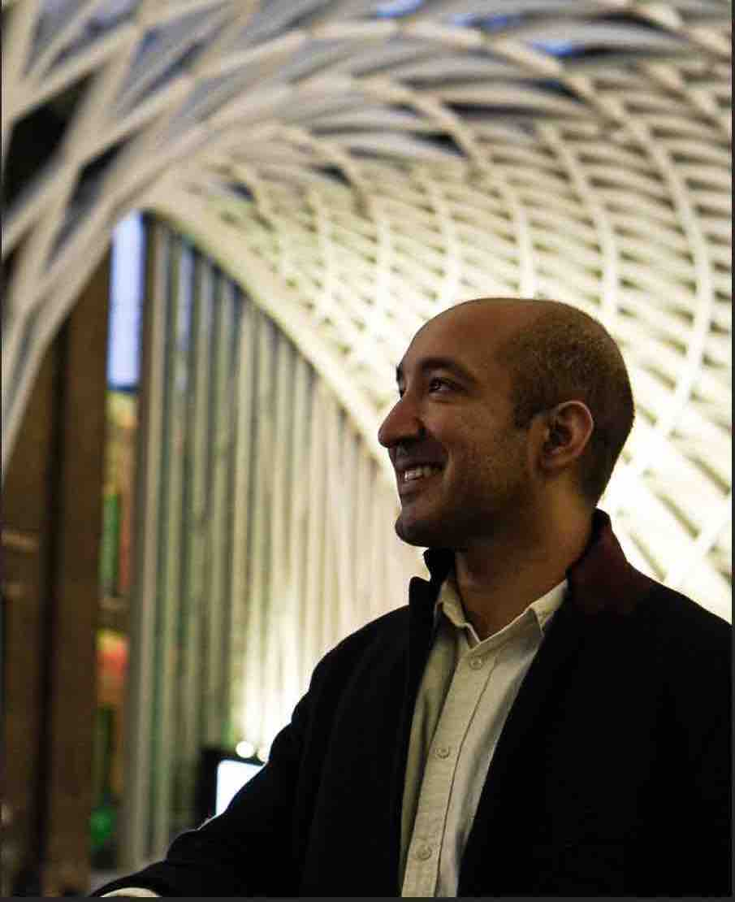

**Currently**

<!--   -->

I am the founding director of [Cambridge Innovation Labs](https://cambridgeinnovationlabs.com/). Since 2024, I have also been an Entrepreneur in Residence with [Digital Education Futures Initiative](https://www.deficambridge.org/) at the University of Cambridge.

<!-- I would like to bring philosophy to bear on daily life through products people use and events they attend.  -->

<figure>
     

    

 <figcaption></figcaption> 
</figure>

---

**Professional**

I have about ten years of experience spanning startups, research, and tech organizations. These pages: [work](/work) and [research](/research) contain the details.

---

**Education** 

I read for a **second** BA in [Philosophy, Politics and Economics](https://www.theguardian.com/education/2017/feb/23/ppe-oxford-university-degree-that-rules-britain?CMP=fb_gu) with senior status at the University of Oxford. I was supported by the KC Mahindra Scholarship, Tiara Special Grant, and a second undergraduate degree scholarship by Harris Manchester College. 

At Oxford, I  wrote an [thesis on congestion option pricing](../files/research/ppethesis.pdf)  and specialized in philosophy of maths. [These are some essays](/philosophy) from that time.

Before Oxford, I graduated from IIT Delhi with a five-year Integrated Masters in Maths and Computing in 2013. My master's thesis in the [design of approximation algorithms for networks](../files/research/thesis.pdf) under [Naveen Garg](https://en.wikipedia.org/wiki/Naveen_Garg) was awarded an outstanding grade by a joint panel of maths and cs department.

----

 **Hobbies** 

In a past life, I used to be a competitive quizzer. I had my 15 minutes on fame when I appeared on some [nationally televised quiz shows](https://www.youtube.com/watch?v=-5pdjrdj0uA) in my college days.  

<!-- 
Within philosophy, I am interested in questions of authenticity and the metaphysics of the self, such as: how does our vital life force work, and what causes it to diminish or flourish? I am interested in integrating academic philosophy and embodied philosophical practices.

 -->

<!-- * [A Writing Course](/courses/writing/intro)
* [Salt To Taste: How I Learnt to Stop Worrying And Love Cooking](/cook)
* [Improv](/improv)
 -->

<!--  With Sarah Maughan, I run a conscious dating workshop in Cambridge.  -->

<!-- I am driven by the philosophy of authenticity and questions in the metaphysics of self, soul, and consciousness that have a deep sense of mystery and magic: we say "be yourself", but how can we possibly fail to be ourselves? How do we get in our own way? How does our vital life force work, and what causes it to diminish or flourish?  -->

<!-- * Meeting Without Masks -->

<!-- 
* Meetings Without Masks: An authentic dating event for singles. Next one: [30th September](https://www.tickettailor.com/events/meetingwithoutmasks/958578) 
 -->
<!-- * Salt To Taste: a series of essays on authenticity -->

<!-- 
 One of the best way to learn is to teach it to someone. Platonia allows one to organize one-on-one meetups with people for learning-and-teaching. Give it a try! Here's the [download link for iOS]((http://itunes.com/apps/platonia)) and here's the [download link for Android](https://play.google.com/store/apps/details?id=com.platonia_client). -->

<!-- - **Teaching:**  I am interested in teaching or mentoring opportunies in philosophy, algorithms, and creative writing.

- **Learning:** I am looking for people interested in practicing Improv, First Aid, or Wilderness survival skills.  

- **Creative Collaborations:** If you'd like to collaborate on something for *fun*, please don't hesitate to reach out. Here are some ideas: a podcast, a comedy sketch, a mobile app, or any long-form writing assignment. 
 -->

---

**Contact**

I find a lot of value in supporting others. If you are a student applying for jobs or further studies, a new grad looking for career advice, or an entepreneur working on a startup, feel free to write to me and I'd help in any way I can.



[resumeFile]: ../files/piyush_resume.pdf 
[thesis]: ../files/research/thesis.pdf

 
